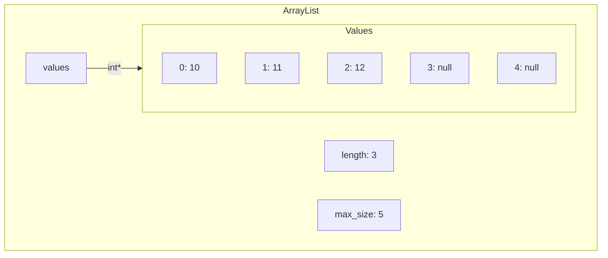
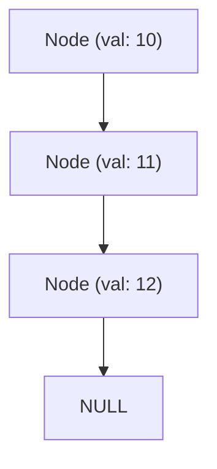

# Жагсаалт

Жагсаалт өгөгдлийн бүтцийг хүснэгт (array) болон холбоост (linked) жагсаалт байдлаар хэрэгжүүлнэ.

## Array List

`array_list.h` файлд тодорхойлсон `ArrayList` бүтэц төрлийн өгөгдлөөр жагсаалтыг дүрслэх бөгөөд `values`-д жагсаалтын утга, `max_size`-д жагсаалтад хадгалж болох дээд хэмжээ, `length`-д жагсаалтад хадгалсан (хэрэглэгдэж буй хэмжээ) элементийн тоог хадгална.

## Linked List

`linked_list.h` файлд тодорхойлсон `Node` бүтэц төрлийн өгөгдлөөр жагсаалтыг дүрслэх бөгөөд `val`-д жагсаалтын утга, `next` заагчид дараагийн элементийн (Node) хаягийг хадгална. Хэрэв төгсгөлийн элемент бол `next` заагчийн утга `NULL` байна.

## Даалгавар:

- `array_list.c` - `array_list.h` толгой файлд тодорхойлсон функцуудыг энэ файлд хэрэгжүүлнэ
- `linked_list.c` - `linked_list.h` толгой файлд тодорхойлсон функцуудыг энэ файлд хэрэгжүүлнэ
- `prog_array.c` - Хүснэгт жагсаалтаа шалгах кодоо энд бичиж болно
- `prog_linked.c` - Холбоост жагсаалтаа шалгах кодоо энд бичиж болно

**Санамж:** `array_list.h` болон `linked_list.h` файлуудад тодорхойлсон функц болон бүтэц төрлийг өөрчлөхгүй байх шаардлагатай. Нэмэлт функц хэрэгтэй гэвэл өөрсдөө бичиж болно. `prog_*` дотор жагсаалтаа хэрэглэх код бичихдээ `test` доторх `demo_array.c`, `demo_linked.c` файлаас жишээ авч болно, харин demo файлуудын агуулгыг өөрчилж болохгүй.

