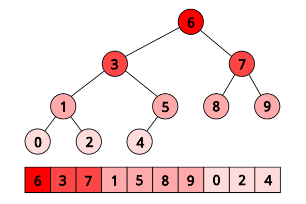

# Binary Tree

Хоёртын модыг нэг хэмжээст массив ашиглан хэрэгжүүлэх.

## Даалгавар

1. `binary_tree.h` дотор тодорхойлсон функцүүдийг `binary_tree.c` файлд хэрэгжүүлэх.
2. Өөрийн хэрэгжүүлэлтээ `main.c` дотор мод үүсгэж, турших.

**Санамж:** Функцын тодорхойлолтын хоёр дахь параметр болох `int` төрөлтэй параметр нь элементийн утгыг илэрхийлнэ.

