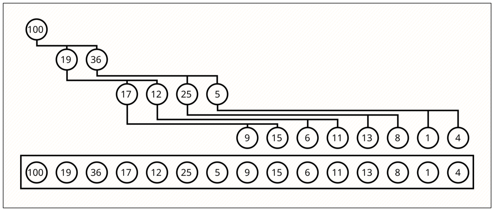

[](https://classroom.github.com/a/zok46RUV)
[](https://classroom.github.com/online_ide?assignment_repo_id=18868386&assignment_repo_type=AssignmentRepo)
# Heap (Binary Tree)

Хоёртын модоор max-heap хэрэгжүүлэх.



## Даалгавар

1. `binary_tree.h` дотор тодорхойлсон функцуудыг `binary_tree.c` файлд хэрэгжүүлэх.
2. Хэрэгжүүлэлтээ `binary_tree.c` болон `main.c` файлыг хамтад нь compile хийж, ажиллуулж, туршина.

**Санамж:** `main` функцийг аль хэдийн бэлдсэн тул өөрчлөлт хийхгүй байна уу.

Compile:

```sh
# Linux/Mac
gcc main.c binary_tree.c -o heap.out

# Windows бол
gcc main.c binary_tree.c -o heap.exe
```

Run:

```sh
# Linux/Mac
./heap.out

# Windows бол
./heap.exe
```

## Ажиллагаа

Программын `main` функц нь `+` болон `-` тэмдгээр heap-д элемент нэмэх болон хасах үйлдлийг гүйцэтгэнэ. Өөр тэмдэгт оруулвал программ зогсоно.

```
+10 # элемент нэмэх
- # элемент хасах
```
