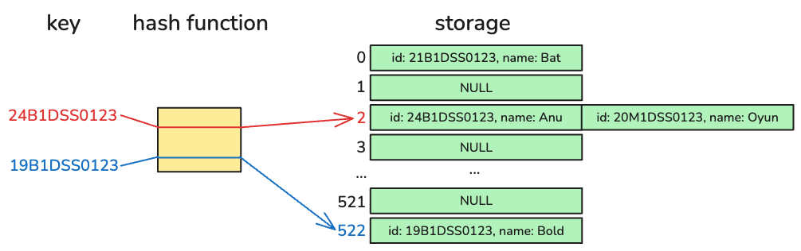

# Hash Table

Hash table хэрэгжүүлэх.

## Гүйцэтгэх ажил

`hashtable.h` толгой файлд өгөгдлийн төрөл болон функцуудыг тодорхойлсон бөгөөд тэдгээрийг `hashtable.cpp` дотор `TODO` хэмээн тэмдэглэсэн хэсгүүдэд хэрэгжүүлнэ.

Hash утга үүсгэхдээ ямар ч төрлийн тооцоолол, арга хэрэглэж болно. Харин `main.cpp` дотор зарласан `hashSize`-н утгаас хэтэрч болохгүй. Hash үүсгэх `int hashf(string id)` функц нь оюутны id өгөхөд түүнд харгалзах hash утгыг тооцоолж гаргах ба hash нь `int` төрөлтэй, hash table-н index байна.

**Санамж:** Git рүү оруулахдаа `main.cpp` болон `hashtable.cpp` доторх хэвлэх функцуудэд өөрчлөлт битгий оруулаарай.

