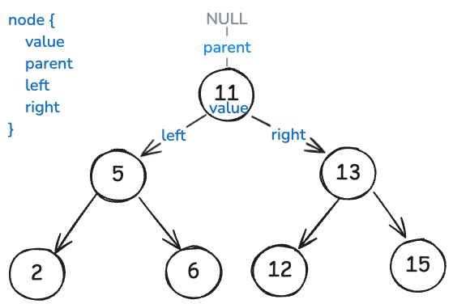

[](https://classroom.github.com/a/aRLK1y-k)
[](https://classroom.github.com/online_ide?assignment_repo_id=19361445&assignment_repo_type=AssignmentRepo)
# AVL мод

Хоёртын хайлтын мод, түүн дээр AVL модыг заагч ашиглан хэрэгжүүлэх.

Хоёртын модны бүтэц:



AVL модны жишээ:


## Гүйцэтгэх ажил

`binary_search_tree.h` толгой файлд өгөгдлийн төрөл болон функцуудыг тодорхойлсон бөгөөд тэдгээрийг `binary_search_tree.c` дотор `TODO` хэмээн тэмдэглэсэн хэсгүүдэд хэрэгжүүлнэ.

`main.c` файл нь гараас `+`, `-` тэмдэглэгээний араас тоон утга авах ба элемент нэмэх болон хасах үйлдлийг гүйцэтгэнэ. Жишээ нь:

```
+5  # 5 утга нэмэх
+3  # 3 утга нэмэх
+6  # 6 утга нэмэх
-3  # 3 утга хасах
-6  # 6 утга хасах
```

**Санамж:** Git рүү оруулахдаа `main.c` дотор өөрчлөлт битгий оруулаарай.
