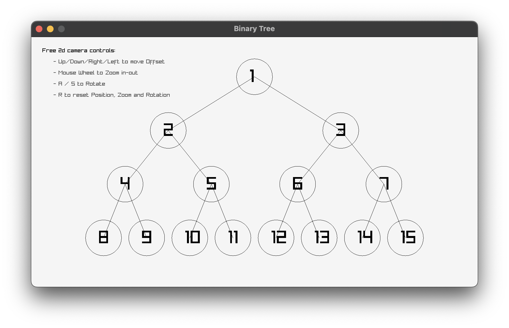

[](https://classroom.github.com/a/bMt59b9i)
[](https://classroom.github.com/online_ide?assignment_repo_id=19379423&assignment_repo_type=AssignmentRepo)
# Хоёртын хайлтын мод дүрслэх

## Гүйцэтгэх ажил

Өмнө хэрэгжүүлсэн хоёртын хайлтын мод дээрээ суурилан модоо дүрсэлж үзүүлэх ба дүрслэх арга нь график эсвэл текст ямар ч байж болно.

Өөрсдийн аргаар дүрсэлж үзүүлэх тул `main.c` дотор чөлөөтэй өөрчлөлт оруулж болно. `binary_search_tree.c` файлд өмнөх даалгавраар хэрэгжүүлсэн хоёртын хайлтын модны хэрэгжүүлэлтээ оруулна.

**Санамж:** Ажиллуулж үзүүлж тооцуулна.

### Жишээ

**Raylib хэрэглэн хэрэгжүүлсэн жишээ:**



**Текстээр хэрэгжүүлсэн жишээ:**

```
             5             
            / \            
           /   \           
          /     \          
         /       \         
        /         \        
       /           \       
      /             \      
     3               7     
    / \             / \    
   /   \           /   \   
  /     \         /     \  
 /       \       /       \ 
1         4     6         8
```
