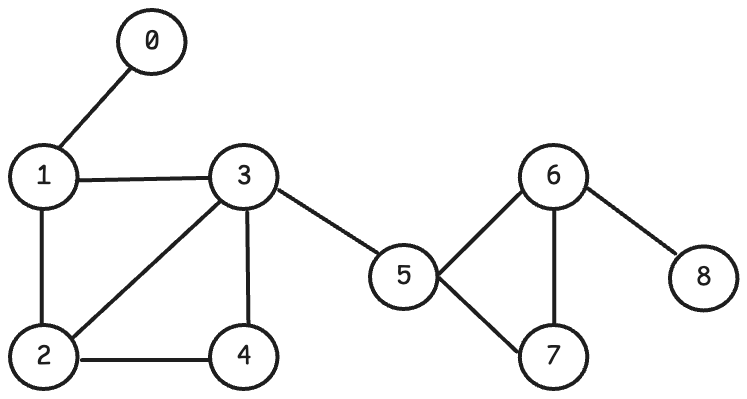
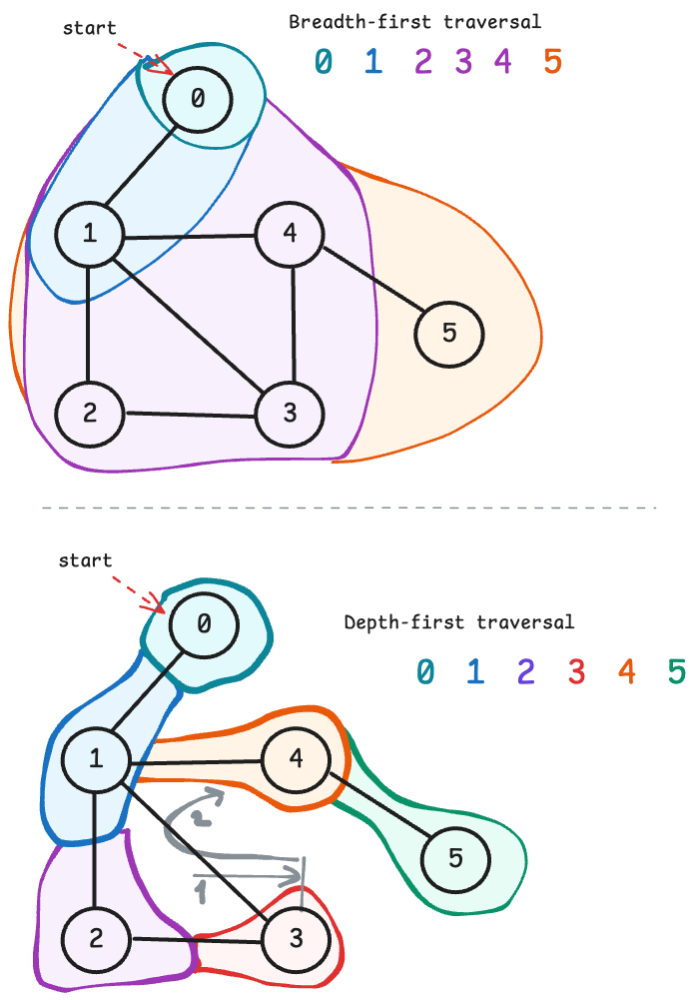
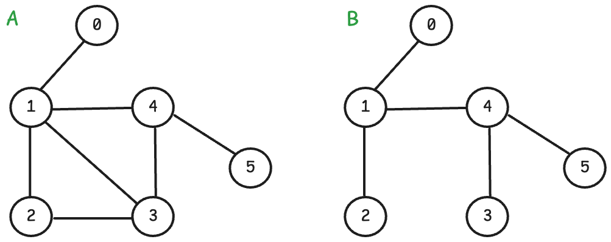
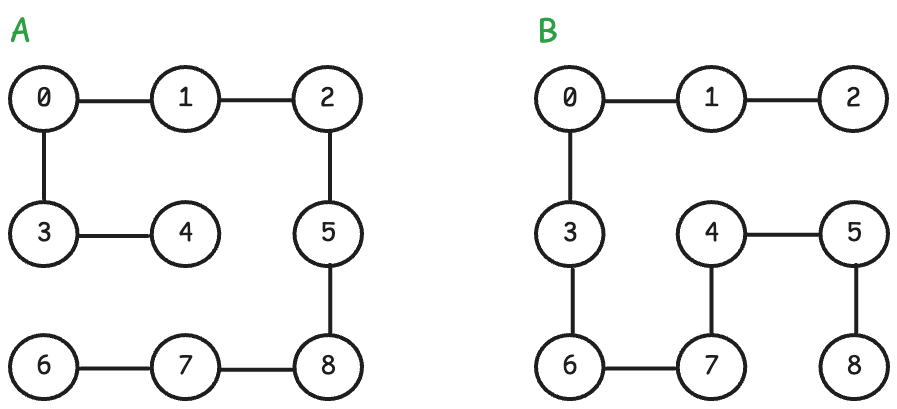

[](https://classroom.github.com/a/6L0tjqQU)
[](https://classroom.github.com/online_ide?assignment_repo_id=19456458&assignment_repo_type=AssignmentRepo)
# Граф

Граф өгөгдлийн бүтцийг хөршийн матриц (adjacency matrix) ашиглан хэрэгжүүлнэ.



Түвшний нэвтрэлт, гүний нэвтрэлтийн жишээ:



## Гүйцэтгэх ажил

`graph.h` толгой файлд өгөгдлийн төрөл болон функцуудыг тодорхойлсон бөгөөд тэдгээрийг `graph.c` дотор `TODO` хэмээн тэмдэглэсэн хэсгүүдэд хэрэгжүүлнэ. Хэрэгжүүлэлтийн явцад нэмэлт функц шаардлагатай (жишээ нь df traversal-д рекурсив функц) бол `graph.c` файлд нэмж хэрэгжүүлж болно.

`main.c` файлд графыг турших хэрэгжүүлэлт аль хэдийн хийгдсэн учих өөрчлөлт оруулах шаардлагагүй. Хэрэглэх зааврыг доор үзүүлэв:

```text
5     # нийт оройн тоо
+0 1  # 0 <-> 1 орой холбосон ирмэг нэмэх
+0 2  # 0 <-> 2 орой холбосон ирмэг нэмэх
+1 2  # 1 <-> 2 орой холбосон ирмэг нэмэх
+1 3  # 1 <-> 3 орой холбосон ирмэг нэмэх
p     # хөршийн матриц хэвлэх
b 0   # 0 оройгоос эхлэн түвшний нэвтрэлт (breadth-first) хийх
d 0   # 0 оройгоос эхлэн гүний нэвтрэлт (depth-first) хийх
s 0 3 # 0-ээс 3 орой хүртэлх богино зам олох
m     # төөрдөг байшин (maze)-г зурж харах (онцгой тохиолдолд хэрэглэнэ)
q     # гарах
```

## Шалгалтын өгөгдөл

A, B тэмдэглэгээгээр шалгалтын явцад үүсэх эхний граф болон өөрчлөлт хийсний дараах хувилбарыг харуулав.

### test/graph1.in



### test/graph2.in



### test/graph3.in


### Maze

`test/maze1.in`, `test/maze2.in` өгөгдөл нь графын нэг онцгой тохиолдлыг агуулах бөгөөд программ ажиллаж байхад `m` командаар хэвлэж харах боломжтой.

graph2.in хэсэгт үзүүлсэн төөрдөг байшингийн текст дүрслэл:

```text
+----+----+----+
   0    1    2 |
+    +----+    +
|  3    4 |  5 |
+----+----+    +
|  6    7    8
+----+----+----+
```

**Санамж:** Git рүү оруулахдаа `main.c` дотор өөрчлөлт битгий оруулаарай.
